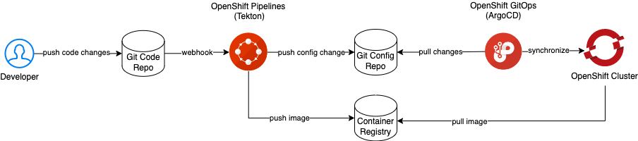

# GitOps Basics

## Introduction

GitOps is a set of best practices where the entire code delivery process is controlled via Git, including infrastructure and application definition as code and automation to complete updates and rollbacks.

The 4 key GitOps principles are:

1. Declarative

    A system managed by GitOps must have its desired state expressed declaratively.

1. Versioned and immutable

    Desired state is stored in a way that enforces immutability, versioning and retains a complete version history.

1. Pulled automatically

    Software agents automatically pull the desired state declarations from the source.

1. Continiously reconciled

    Software agents continuously observe actual system state and attempt to apply the desired state.

This guided exercise demonstrates these principles using Red Hat OpenShift Container Platform, OpenShift Pipelines, OpenShift GitOps, a sample application and GitHub.



## Create an OpenShift Container Platform cluster

[Deploy Red Hat OpenShift Kubernetes Service on IBM Cloud](https://cloud.ibm.com/schematics/workspaces/create?repository=https://github.ibm.com/ramons/ibm-cloud-vpc-roks/tree/main&terraform_version=terraform_v1.1){ .md-button }

## Log in the cluster with cluster-admin privileges

1. Open a [IBM Cloud Shell](https://cloud.ibm.com/shell)

1. Log in the cluster

    ```sh
    export CLUSTER_NAME=<replace-with-your-cluster-name>
    ```
    ```sh
    ibmcloud oc cluster config -c ${CLUSTER_NAME} --admin
    ```

## Install the operators

Copy and paste the commands below

1. GitOps

    ```sh
    cat <<EOF | oc apply -f -
    apiVersion: operators.coreos.com/v1alpha1
    kind: Subscription
    metadata:
      name: openshift-gitops-operator
      namespace: openshift-operators
    spec:
      channel: stable
      installPlanApproval: Automatic
      name: openshift-gitops-operator
      source: redhat-operators
      sourceNamespace: openshift-marketplace
    EOF
    ```
    Wait until the Pods in namespace `openshift-gitops` are running
    ```sh
    watch oc get pods -n openshift-gitops
    ```
    Ctrl+C quits the `watch` command.

    Example list of Pods
    ```text
    NAME                                                         READY   STATUS    RESTARTS   AGE
    cluster-675fb59f99-dhd5z                                     1/1     Running   0          21m
    kam-5c6794574c-p49rg                                         1/1     Running   0          21m
    openshift-gitops-application-controller-0                    1/1     Running   0          21m
    openshift-gitops-applicationset-controller-fbdc46758-nbph7   1/1     Running   0          21m
    openshift-gitops-dex-server-9469ff6df-gjn29                  1/1     Running   0          21m
    openshift-gitops-redis-7867d74fb4-4sv8v                      1/1     Running   0          21m
    openshift-gitops-repo-server-55876d7c9b-42bkb                1/1     Running   0          21m
    openshift-gitops-server-76c7d47754-72sj7                     1/1     Running   0          21m
    ```

1. Pipelines 

    ```sh
    cat <<EOF | oc apply -f -
    apiVersion: operators.coreos.com/v1alpha1
    kind: Subscription
    metadata:
      name: openshift-pipelines-operator
      namespace: openshift-operators
    spec:
      channel: stable
      name: openshift-pipelines-operator-rh
      source: redhat-operators
      sourceNamespace: openshift-marketplace
    EOF
    ```
    Wait until the Pods in namespace `openshift-pipelines` are running
    ```sh
    watch oc get pods -n openshift-pipelines
    ```
    Example list of Pods
    ```text
    NAME                                                 READY   STATUS    RESTARTS   AGE
    tekton-operator-proxy-webhook-697fccc9cc-hpqtd       1/1     Running   0          3m1s
    tekton-pipelines-controller-65c59d7f5c-wjnpp         1/1     Running   0          3m21s
    tekton-pipelines-webhook-75fff6f875-62qn6            1/1     Running   0          3m11s
    tekton-triggers-controller-756594b64d-zgrrw          1/1     Running   0          2m14s
    tekton-triggers-core-interceptors-84bd74965b-vnpnx   1/1     Running   0          2m6s
    tekton-triggers-webhook-5d96785c49-4k4dh             1/1     Running   0          2m7s
    tkn-cli-serve-f49cc4dfc-w9hjr                        1/1     Running   0          45s
    ```

## Set up the project

1. Create the project

    ```sh
    oc new-project demo
    ```

1. Create the pipeline

    ```sh
    oc apply -f https://raw.githubusercontent.com/ibm-cloud-automation/hello-pipeline/main/pipeline.yaml
    ```

1. Claim storage for the pipeline

    ```sh
    oc apply -f https://raw.githubusercontent.com/ibm-cloud-automation/hello-pipeline/main/pvc.yaml
    ```

1. Create an SSH key pair 

    ```sh
    ssh-keygen -t ed25519 -N '' -f id_pipeline
    ```

1. Download the key pair from the IBM Cloud Console

    Click the download button { width=32 } and download `id_pipeline` and `id_pipeline.pub`

    !!! note

        `id_pipeline` is saved as `id_pipeline.txt`

1. Add a deploy key to the `hello-config` repository

    1. Using the Github Web UI select the `hello-config` repository
    1. Click Settings
    1. On the left hand side click Deploy Keys
    1. Click the Add deploy key button
    1. Set the Title to "pipeline" and paste the contents of `id_pipeline.pub` into the Key field
    1. Tick Allow write access and lastly click the Add key button

1. Create a Secret that holds the private SSH key

    ```sh
    oc create secret generic github \
      --from-file=ssh-privatekey=id_pipeline \
      --type=kubernetes.io/ssh-auth
    ```

1. Annotate the Secret for Tekton

    ```sh
    oc annotate secret github tekton.dev/git-0=github.com
    ```

1. Link the Secret to the pipeline service account

    ```sh
    oc secret link pipeline github
    ```

1. Annotate the project for OpenShift GitOps

    ```sh
    oc label namespace demo argocd.argoproj.io/managed-by=openshift-gitops
    ```

## Verify the pipline by manually running it

1. Create the PipelineRun

    ```sh
    oc create -f https://raw.githubusercontent.com/ibm-cloud-automation/hello-pipeline/main/pipeline-run.yaml
    ```

1. Monitor the PipelineRun

    ```sh
    tkn pr logs -f -L
    ```

## Automate the PipelineRun

1. Create the Trigger and related artefacts

    ```sh
    oc apply -f https://raw.githubusercontent.com/ibm-cloud-automation/hello-pipeline/main/trigger.yaml
    ```

1. Create a Route for the EventListener

    ```sh
    oc expose svc/el-hello-app
    ```

1. Echo the input for the GitHub WebHook Payload URL

    ```sh
    echo "$(oc get route el-hello-app --template='http://{{.spec.host}}')"
    ```

1. Create a GitHub Webhook for the `hello` repository

    1. Copy and paste the Payload URL
    1. Set the Content type to `application/json`
    1. Click the Add webhook button

## Trigger the WebHook

1. Clone the code repository

    ```sh
    git clone git@github.com:ibm-cloud-automation/hello.git
    ```

1. Start the SSH agent and add the pipeline key

    ```sh
    eval $(ssh-agent -s)
    ```
    ```sh
    ssh-add -k id_pipeline
    ```

1. Commit and push a change

    ```sh
    git commit --allow-empty -m "Trigger PipelineRun"
    ```
    ```sh
    git push
    ```

1. Monitor the PipelineRun

    ```sh
    tkn pr logs -f -L
    ```

## Create the ArgoCD application

1. Create the Application

    ```sh
    cat <<EOF | oc apply -f -
    apiVersion: argoproj.io/v1alpha1
    kind: Application
    metadata:
      name: hello
      namespace: openshift-gitops
    spec:
      destination:
        name: ''
        namespace: demo
        server: 'https://kubernetes.default.svc'
      source:
        path: base
        repoURL: 'https://github.com/ibm-cloud-automation/hello-config'
        targetRevision: HEAD
      project: default
    EOF
    ```
1. Get the ArgoCD admin password

    ```sh
    oc -n openshift-gitops extract secret/openshift-gitops-cluster --to=- --keys=admin.password
    ```

1. Get the ArgoCD URL

    ```sh
    echo "$(oc get route/openshift-gitops-server -n openshift-gitops --template='https://{{.spec.host}}')"
    ```

1. Open a browser tab and paste the ArgoCD URL, login as user admin

1. Click the SYNC button followed by the SYNCHRONIZE button (leave all fields to their default values)

1. Check the application Pod

    ```sh
    oc get pod -l app=hello
    ```

A Route is missing for the application, let's add one, the GitOps way 

## Add a Route for the application

1. Generate the host input for the Route

    ```sh
    oc get ingresses.config/cluster --template='hello.{{.spec.domain}}{{"\n"}}'
    ```

1. Navigate to the `hello-config` repository on GitHub

1. Type . (a dot) to start the Web Editor

1. Expand the base folder and click New file, name the file `route.yaml`

1. Copy and paste the yaml below into the file

```yaml
apiVersion: route.openshift.io/v1
kind: Route
metadata:
  labels:
    app: hello
  name: hello
spec:
  host:
  port:
    targetPort: 1970
  to:
    kind: Service
    name: hello
    weight: 100
  wildcardPolicy: None
```

1. Append the output from step 1 after `host:`

1. Save and close

1. Update `kustomization.yaml` so it includes `route.yaml`

1. Commit the changes

1. Switch to the ArgoCD UI and sync the application

## Test the Route

1. Get the application URL

    ```sh
    oc get route/hello --template='http://{{.spec.host}}'
    ```

1. Open the application URL in a browser tab

    The message "Hello universe" is displayed.
